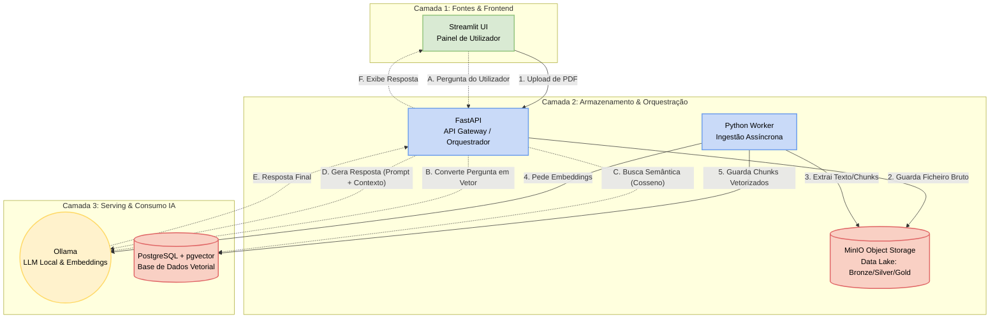

# 🚀 RAG Data Platform: Plataforma de Dados e Ingestão Escalável para LLMs

[](https://www.python.org/)
[](https://www.docker.com/)
[](https://www.postgresql.org/)
[](https://fastapi.tiangolo.com/)

Uma infraestrutura corporativa local e ponta a ponta para **Engenharia de Dados aplicada a LLMs (Retrieval-Augmented Generation)**. Este projeto simula um ambiente produtivo de microsserviços para ingestão, processamento, vetorização e consumo de dados não estruturados (PDFs).


---

## 🚀 Objetivo

Construir um pipeline de dados e inteligência artificial que:
- ingere documentos em diferentes formatos;
- armazena dados em PostgreSQL com `pgvector`;
- mantém arquivos em MinIO como data lake;
- utiliza um modelo LLM local via Ollama;
- expõe API REST e UI Streamlit para consulta e pesquisa.

## 🧱 Stack principal

- Python 3.11
- FastAPI
- Streamlit
- PostgreSQL + pgvector
- MinIO
- Ollama
- SQLAlchemy
- LangChain text splitters
- Sentence Transformers

## 📁 Estrutura do projeto

- `docker-compose.yml` - orquestra os serviços: `postgres`, `minio`, `ollama`, `api`, `ingestion`, `frontend`
- `Dockerfile` - imagem base Python para serviços de produção/local
- `requirements.txt` - dependências Python necessárias
- `src/`
  - `config/settings.py` - configurações e variáveis de ambiente
  - `frontend/app.py` - app Streamlit
  - `pipelines/run_ingestion.py` - workflow de ingestão de dados
  - `pipelines/extraction/` - carregadores de documentos (`pdf_loader.py`, `txt_loader.py`)
  - `pipelines/transformation/` - limpeza e quebra de texto (`text_cleaner.py`, `text_splitter.py`)
  - `pipelines/loading/` - carregamento para data lake e vetor store
  - `services/ai/` - embeddings e cliente LLM
  - `services/api/main.py` - app FastAPI
  - `services/api/routes/` - rotas da API (`documents.py`, `query.py`)
  - `services/business/rag_engine.py` - lógica de RAG
  - `shared/database/session.py` - sessão de banco de dados
  - `shared/storage/minio_client.py` - cliente MinIO
- `data/` - local para dados e conteúdos ingestados
- `docker/` - scripts e arquivos de inicialização de containers

## ⚙️ Serviços em `docker-compose`

- `postgres`: banco de dados com `pgvector`
- `minio`: armazenamento de objetos compatível com S3
- `ollama`: LLM local para inferência
- `api`: API FastAPI em `http://localhost:8000`
- `ingestion`: worker de ingestão de dados
- `frontend`: interface Streamlit em `http://localhost:8501`

## ▶️ Como rodar o projeto

### 1. Pré-requisitos

- Docker e Docker Compose instalados
- Python 3.11 (opcional para execução local sem Docker)

### 2. Rodar com Docker Compose

```bash
cd "C:\Users\vicsf\OneDrive\Área de Trabalho\RAG"
docker compose up --build
```

### 3. Acessar serviços

- API: `http://localhost:8000`
- Documentação OpenAPI: `http://localhost:8000/docs`
- Front-end Streamlit: `http://localhost:8501`
- MinIO Console: `http://localhost:9001`

### 4. Variáveis de ambiente

O `docker-compose.yml` já define valores padrão para:

- `POSTGRES_USER`, `POSTGRES_PASSWORD`, `POSTGRES_DB`
- `MINIO_ROOT_USER`, `MINIO_ROOT_PASSWORD`
- `DATABASE_URL`
- `MINIO_ENDPOINT`
- `OLLAMA_ENDPOINT`

Se quiser personalizar, crie um arquivo `.env` ou exporte as variáveis antes de executar.

## 🧪 Fluxo de ingestão

O serviço `ingestion` executa o pipeline de ingestão:
- faz extração de textos de arquivos
- limpa e quebra conteúdo
- gera embeddings
- salva no banco e no data lake

Se você quiser rodar localmente dentro do container, o comando já está configurado em `docker-compose.yml`.

## 💡 Dicas de desenvolvimento

- O serviço `api` depende de `postgres`, `minio` e `ollama`
- Se precisar reiniciar somente o front-end ou API, use:
  - `docker compose restart api`
  - `docker compose restart frontend`
- Para remover containers e volumes:
  - `docker compose down -v`

## 🔎 Endpoints principais

- `GET /health` - health check do serviço API
- `GET /docs` - documentação interativa da API
- `POST /documents/upload` - upload de documento (`.pdf`, `.txt`, `.md`)
- `POST /query` - consulta RAG com pergunta e limite de resultados

## 🧪 Exemplos de uso

### Consulta RAG

```bash
curl -X POST http://localhost:8000/query \
  -H "Content-Type: application/json" \
  -d '{"question": "Qual é o objetivo do projeto?", "limit": 3}'
```

### Upload de documento

```bash
curl -X POST http://localhost:8000/documents/upload \
  -F "file=@/caminho/para/seu/arquivo.pdf"
```

## 📌 Observações

- O projeto já está preparado para rodar em container com dependências instaladas à cada inicialização.
- Caso use `docker compose up` e deseje ver logs específicos de um serviço, execute `docker compose logs -f api`.

---

Desenvolvido como base para uma arquitetura RAG modular e orientada a dados, com pipeline de ingestão, vetor store e interface de consulta.
